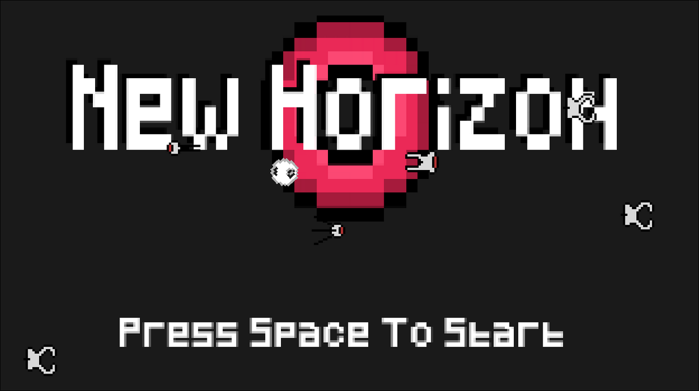
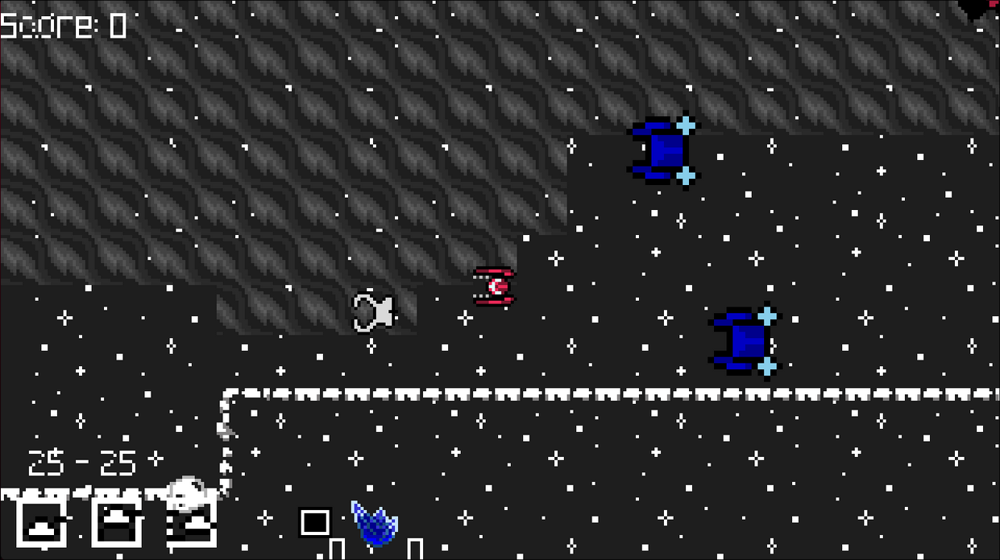
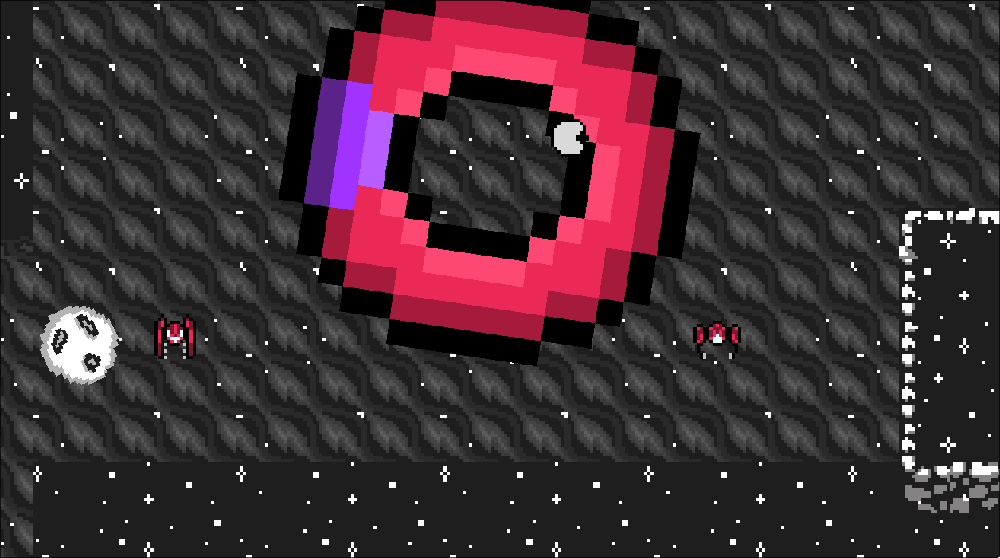

# New Horizon

A two-player local co-op space game made for the Opera GX Game Jam.

## About

Pick your ship — **Shooter**, **Fighter**, or **Bomber** — and survive together in deep space. Fight off waves of enemies and a boss, mine minerals, collect materials and upgrades, and build defensive towers to hold the line.

## Screenshots

  
  

## Built with

Made in **GameMaker Studio 2**. To run or build the game, open `OperaJam3.0.yyp` in the GameMaker IDE.
